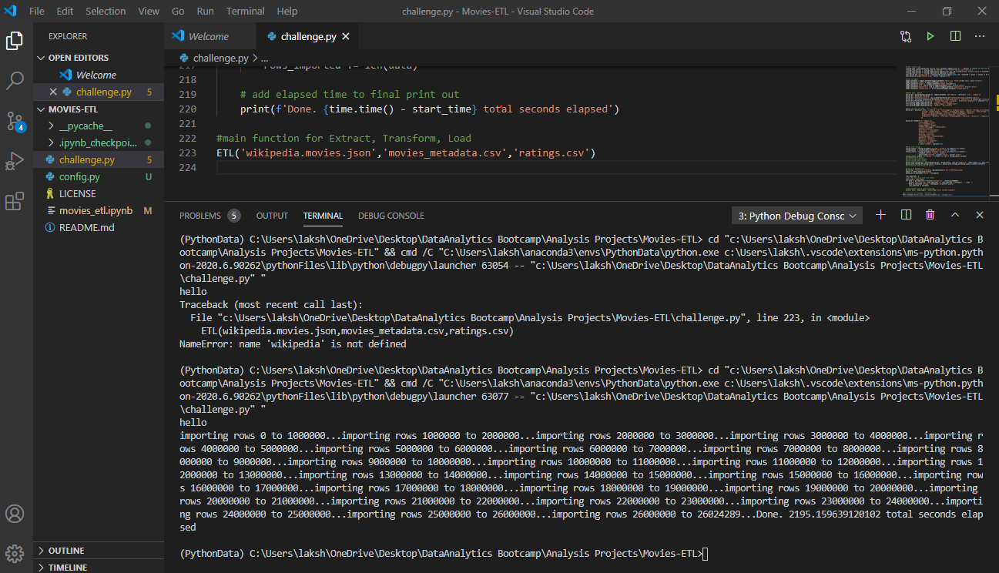

# Movies-ETL

##A. Background

**E**xtract data from Wikipedia and Kaggle databases about movie reviews. 
**T**ransform (Clean and combine the data) to one and **L**oad (upload) to SQL ,postgres database

##B. Key Assumptions / Method for ETL
1. Inspect and filter data
	- example alternat title and condensing thevarious columns
2. Duplicates ar common, remove them as part of the cleaning process
	- Use regular expression to filter
	- drop duplicates
3. Drop null columns
	- 90% or more data in the column entries are null

4. get the dtypes correct by using pandas to_numeric etc type conversions
	- prior to that have to parse the data in the key columns and get 
them to the correct exprssion	
	- use regex type to tranform the data and get to consistent units
	 - i.e million, billion etc converted to same baseline
5.Search for bad data/corrupted data and clean it out. 
	- sometimes columns are mixed up, drop those rows are fix it if possible.

6. Merging databases
	- list column by column to merge across the databases
	- option 1 :clean up columns and merge the best of each
	- option 2 :if there is much cleaner column, use that and drop the other.
		- sometimes you can plot the column against each other to see the skew and make decisions
7. uploading to sql
        - create a connection string to access to database
	- use pandas to_sql to connect and ceate. This connection object is used to load columns and data.
	- large data have to uploaded in chunks , e.g 1000000  bytes..

8. Automate the process for periodic update with the complete python script
	- challenge.py for this exercise (movies_etl.ipynb for practice/development)
	- example of output for this challenge

	